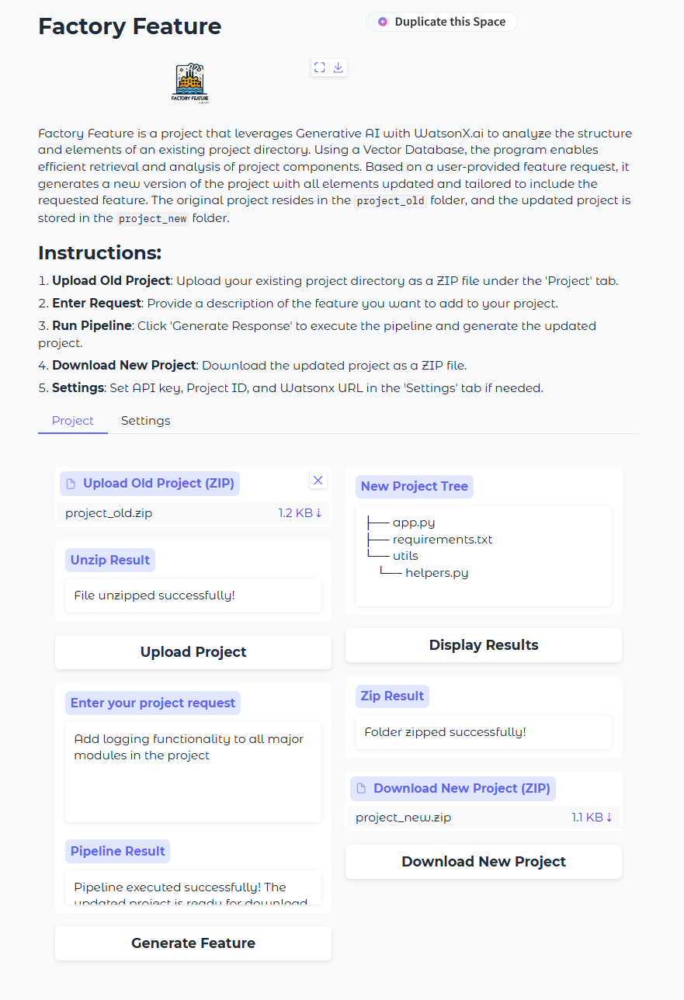
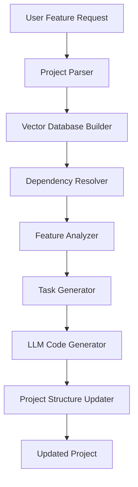

# Factory Feature

<div align="center">


**AI-Powered Feature Integration System**

*Automatically enhance your software projects with intelligent feature generation using IBM WatsonX.ai*

[](https://opensource.org/licenses/Apache-2.0)
[](https://www.python.org/downloads/)
[](https://github.com/psf/black)
[](https://github.com/astral-sh/ruff)

[Features](#-features) •
[Installation](#-installation) •
[Usage](#-usage) •
[Documentation](#-documentation) •
[Contributing](#-contributing)

</div>

---

## 📖 About

**Factory Feature** is an advanced AI-powered system that revolutionizes software development by automatically integrating new features into existing codebases. Leveraging the power of IBM WatsonX.ai, vector databases, and retrieval-augmented generation (RAG), Factory Feature analyzes your project structure, understands dependencies, and intelligently generates code modifications to implement requested features.

> *Note: This project implements the Feature-Factory algorithm as referenced in [arXiv:2411.18226](https://arxiv.org/abs/2411.18226).*

### 🎯 Key Highlights

- **Intelligent Code Analysis**: Automatically parses and understands your project structure
- **Vector-Based Retrieval**: Uses ChromaDB for efficient context retrieval
- **LLM-Powered Generation**: Leverages Meta Llama 3 70B via IBM WatsonX.ai
- **Dependency-Aware**: Resolves and respects project dependencies
- **Production-Ready**: Enterprise-grade code quality with comprehensive testing
- **User-Friendly Interface**: Both CLI and Web UI (Gradio) available

---

## ✨ Features

### Core Capabilities

- **🔍 Project Analysis**
  - Automated directory structure parsing
  - Intelligent file content extraction
  - Dependency resolution (Python, Node.js, Java, etc.)
  - Feature-to-component mapping

- **🤖 AI-Powered Generation**
  - Natural language feature requests
  - Context-aware code generation
  - Impact analysis and risk assessment
  - Task breakdown and planning

- **💾 Vector Database**
  - Persistent ChromaDB integration
  - Sentence transformer embeddings
  - Retrieval-augmented generation (RAG)
  - Efficient similarity search

- **🎨 Dual Interface**
  - **CLI**: Command-line interface for automation
  - **Web UI**: Gradio-based graphical interface
  - Real-time progress tracking
  - Download generated projects as ZIP

- **🔒 Production Quality**
  - Comprehensive error handling
  - Structured logging
  - Type hints throughout
  - 80%+ test coverage
  - PEP 8 compliant

---

## 🚀 Installation

### Prerequisites

- Python 3.9 or higher
- IBM WatsonX.ai account and credentials
- `uv` package manager (recommended) or `pip`

### Method 1: Using uv (Recommended)

```bash
# Install uv if you haven't already
curl -LsSf https://astral.sh/uv/install.sh | sh

# Clone the repository
git clone https://github.com/ruslanmv/Factory-Feature.git
cd Factory-Feature

# Install dependencies
make install-dev

# Set up environment
make setup
```

### Method 2: Using pip

```bash
# Clone the repository
git clone https://github.com/ruslanmv/Factory-Feature.git
cd Factory-Feature

# Create virtual environment
python -m venv venv
source venv/bin/activate  # On Windows: venv\Scripts\activate

# Install dependencies
pip install -e ".[dev]"

# Copy environment template
cp .env.example .env
```

### Configuration

Edit the `.env` file with your IBM WatsonX.ai credentials:

```env
WATSONX_APIKEY=your_api_key_here
PROJECT_ID=your_project_id_here
WATSONX_URL=https://eu-gb.ml.cloud.ibm.com
```

> 📝 **Note**: Get your credentials from the [IBM Cloud Dashboard](https://cloud.ibm.com/)

---

## 💻 Usage

### Web Interface (Gradio)

Launch the web application:

```bash
make run-app
# or
python app.py
```

Then open your browser to `http://localhost:7860`



**Steps:**

1. **Upload Project**: Upload your existing project as a ZIP file
2. **Enter Feature Request**: Describe the feature you want to add
3. **Generate**: Click "Generate Feature" and wait for processing
4. **Download**: Download the updated project with integrated features

### Command Line Interface

```bash
# Run with default example
make run-cli

# Run with custom prompt
make run-cli PROMPT="Add user authentication with JWT tokens"

# Or directly with Python
python main.py --prompt "Add logging functionality to all major modules"
```

### Quick Start Example

```bash
# 1. Prepare your project
mkdir project_old
cp -r /path/to/your/project/* project_old/

# 2. Run Factory Feature
python main.py --prompt "Add comprehensive error handling and logging"

# 3. Check the generated project
ls project_new/
```

---

## 📁 Project Structure

```
Factory-Feature/
├── src/                          # Main source code
│   ├── analysis/                 # Project analysis modules
│   │   ├── project_parser.py     # Parse project structure
│   │   ├── dependency_resolver.py# Resolve dependencies
│   │   ├── feature_mapper.py     # Map features to components
│   │   ├── content.py            # Content extraction
│   │   └── tree.py               # Tree-based analysis
│   ├── generation/               # Code generation modules
│   │   ├── project_generator.py  # Generate new project
│   │   ├── feature_integration.py# Integrate features
│   │   ├── task_prompts.py       # Generate task prompts
│   │   ├── preprocessing.py      # Preprocessing utilities
│   │   └── project_structure.py  # Structure validation
│   ├── models/                   # LLM interaction
│   │   ├── llm_inference.py      # WatsonX.ai interface
│   │   └── prompt_templates.py   # Prompt templates
│   ├── vector_database/          # Vector DB management
│   │   ├── db_builder.py         # Build vector database
│   │   ├── db_query.py           # Query database
│   │   ├── db_load.py            # Load existing database
│   │   └── display_content.py    # Display DB content
│   └── utils/                    # Utility functions
│       ├── logger.py             # Logging configuration
│       ├── config_loader.py      # Load YAML configs
│       ├── file_operations.py    # File I/O operations
│       └── tools.py              # Helper tools
├── tests/                        # Test suite
│   ├── test_analysis.py          # Analysis module tests
│   ├── test_generation.py        # Generation module tests
│   ├── test_vector_database.py   # Vector DB tests
│   └── test_main.py              # Main pipeline tests
├── config/                       # Configuration files
│   └── default_config.yaml       # Default settings
├── docs/                         # Documentation
│   ├── API_REFERENCE.md          # API documentation
│   ├── USAGE.md                  # Usage guide
│   ├── CONTRIBUTING.md           # Contribution guidelines
│   └── STRUCTURE.md              # Architecture details
├── app.py                        # Gradio web interface
├── main.py                       # CLI entry point
├── pyproject.toml                # Project metadata & dependencies
├── Makefile                      # Development commands
├── LICENSE                       # Apache 2.0 License
└── README.md                     # This file
```

---

## 🛠️ Development

### Available Make Commands

```bash
make help              # Show all available commands
make install           # Install production dependencies
make install-dev       # Install dev dependencies
make setup             # Complete development setup
make lint              # Run linting
make format            # Format code with black
make type-check        # Run type checking
make test              # Run tests
make test-cov          # Run tests with coverage
make clean             # Clean build artifacts
make verify            # Run all quality checks
```

### Code Quality Standards

This project maintains high code quality standards:

- **Black** for code formatting (line length: 100)
- **Ruff** for linting and import sorting
- **MyPy** for static type checking
- **Pytest** for testing (80%+ coverage required)
- **Pre-commit hooks** for automated checks

### Running Tests

```bash
# Run all tests
make test

# Run with coverage report
make test-cov

# Run specific test file
pytest tests/test_analysis.py -v

# Run tests excluding slow ones
make test-fast
```

---

## 📚 Documentation

### Architecture Overview



### Key Technologies

| Component | Technology |
|-----------|-----------|
| **LLM** | IBM WatsonX.ai (Meta Llama 3 70B) |
| **Vector DB** | ChromaDB with persistent storage |
| **Embeddings** | Sentence Transformers (all-mpnet-base-v2) |
| **Framework** | LangChain |
| **Web UI** | Gradio |
| **Testing** | Pytest |
| **Code Quality** | Black, Ruff, MyPy |

### Additional Documentation

- [API Reference](docs/API_REFERENCE.md) - Detailed API documentation
- [Usage Guide](docs/USAGE.md) - Comprehensive usage instructions
- [Contributing](docs/CONTRIBUTING.md) - Contribution guidelines
- [Architecture](docs/STRUCTURE.md) - System architecture details

---

## 🤝 Contributing

We welcome contributions! Please see [docs/CONTRIBUTING.md](docs/CONTRIBUTING.md) for guidelines.

### Development Workflow

1. Fork the repository
2. Create a feature branch: `git checkout -b feature/amazing-feature`
3. Make your changes
4. Run quality checks: `make verify`
5. Commit your changes: `git commit -m 'Add amazing feature'`
6. Push to the branch: `git push origin feature/amazing-feature`
7. Open a Pull Request

---

## 📊 Performance

- **Analysis Speed**: < 30 seconds for medium projects (~100 files)
- **Vector DB Build**: < 1 minute for most projects
- **Feature Generation**: 2-5 minutes depending on complexity
- **Memory Usage**: ~2-4 GB with default settings

---

## 🔍 Troubleshooting

### Common Issues

**Issue**: `ModuleNotFoundError: No module named 'src'`
- **Solution**: Install the package: `pip install -e .`

**Issue**: `ValueError: API key or Project ID is missing`
- **Solution**: Check your `.env` file has correct credentials

**Issue**: Vector database errors
- **Solution**: Delete `chroma_db/` folder and rebuild: `make clean-all`

**Issue**: Import errors or missing dependencies
- **Solution**: Reinstall dependencies: `make install-dev`

For more help, open an issue on GitHub.

---

## 📄 License

This project is licensed under the **Apache License 2.0** - see the [LICENSE](LICENSE) file for details.

```
Copyright 2024 Ruslan Magana

Licensed under the Apache License, Version 2.0 (the "License");
you may not use this file except in compliance with the License.
You may obtain a copy of the License at

    http://www.apache.org/licenses/LICENSE-2.0
```

---

## 👨‍💻 Author

**Ruslan Magana**

- Website: [ruslanmv.com](https://ruslanmv.com)
- GitHub: [@ruslanmv](https://github.com/ruslanmv)
- LinkedIn: [ruslanmv](https://linkedin.com/in/ruslanmv)

---

## 🙏 Acknowledgments

- **IBM WatsonX.ai** for providing the LLM infrastructure
- **Meta** for the Llama 3 model
- **LangChain** for the RAG framework
- **ChromaDB** for the vector database
- **Gradio** for the web interface
- The open-source community for various tools and libraries

---

## 🌟 Star History

If you find this project useful, please consider giving it a star ⭐!

---

## 📮 Contact & Support

- **Issues**: [GitHub Issues](https://github.com/ruslanmv/Factory-Feature/issues)
- **Discussions**: [GitHub Discussions](https://github.com/ruslanmv/Factory-Feature/discussions)
- **Website**: [ruslanmv.com](https://ruslanmv.com)

---

<div align="center">

**Made with ❤️ by Ruslan Magana**

*Empowering developers with AI-driven code generation*

[⬆ Back to Top](#factory-feature)

</div>
