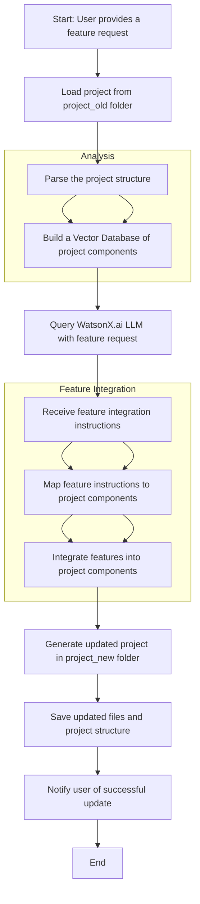

### **Structure**
Here's a complete workflow of the functionality of the Factory Feature application represented using **Mermaid** code. This visualization will help illustrate the process, from receiving a feature request to generating an updated project.

---

### **Workflow Explanation**

1. **User Input**:
   - The user starts the process by providing a feature request through the command line.

2. **Project Loading**:
   - The application reads and loads the original project files from the `project_old` folder.

3. **Project Parsing**:
   - The project structure is parsed to identify and analyze its components (files, code, dependencies).

4. **Vector Database Creation**:
   - A Vector Database is created to store the components of the project for efficient retrieval and analysis.

5. **Query WatsonX.ai**:
   - The feature request is sent to WatsonX.ai's LLM, along with the context from the Vector Database.

6. **Feature Instructions**:
   - WatsonX.ai responds with instructions on how to integrate the requested feature into the project.

7. **Mapping Features to Components**:
   - The instructions are mapped to specific project components to identify where changes are needed.

8. **Feature Integration**:
   - The identified components are updated to include the requested feature, following the instructions provided by WatsonX.ai.

9. **Project Generation**:
   - A new project structure is created in the `project_new` folder, reflecting the integrated feature.

10. **File Saving**:
    - The updated files and project structure are saved in the designated folder.

11. **User Notification**:
    - The user is notified that the updated project has been successfully generated.
